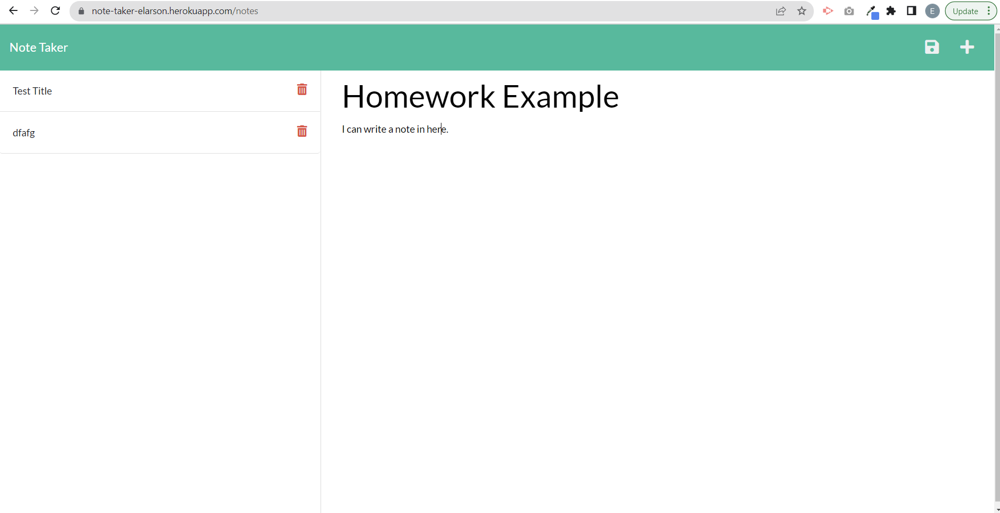
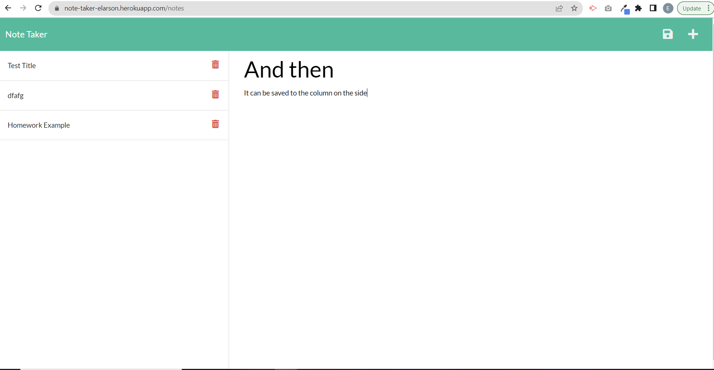

# NoteTaker

## Description

For this assignment, we were given the front-end code for a note taking application, which allows the user to write a new note with a title and text, and then save that note to a sidebar. When the user clicks on a saved note, they will be able to view it on the main portion of the screen. Our task for this application was to write the server side code which connects the supplied files via routes, and gives the application its true functionality. The first path, "/notes?, redirects the user from the main page to the notes page, which displays the notes they have previously written. The other path, "/api/notes", will write the new notes to the db.json file, thus allowing them to be displayed to the page for the user to view.

At the time of assignment submission, I have not written server code to allow the user to delete their previously saved notes. I will continue to work on this and may resubmit in the future for this code to be reviewed.

## Installation

The express and uuid npm packages were necessary to install in order to write functional server code.

## Tests

No tests necessary for this assignment.

## Licensing

MIT License

Copyright (c) 2022 Elizabeth Larson

Permission is hereby granted, free of charge, to any person obtaining a copy
of this software and associated documentation files (the "Software"), to deal
in the Software without restriction, including without limitation the rights
to use, copy, modify, merge, publish, distribute, sublicense, and/or sell
copies of the Software, and to permit persons to whom the Software is
furnished to do so, subject to the following conditions:

The above copyright notice and this permission notice shall be included in all
copies or substantial portions of the Software.

THE SOFTWARE IS PROVIDED "AS IS", WITHOUT WARRANTY OF ANY KIND, EXPRESS OR
IMPLIED, INCLUDING BUT NOT LIMITED TO THE WARRANTIES OF MERCHANTABILITY,
FITNESS FOR A PARTICULAR PURPOSE AND NONINFRINGEMENT. IN NO EVENT SHALL THE
AUTHORS OR COPYRIGHT HOLDERS BE LIABLE FOR ANY CLAIM, DAMAGES OR OTHER
LIABILITY, WHETHER IN AN ACTION OF CONTRACT, TORT OR OTHERWISE, ARISING FROM,
OUT OF OR IN CONNECTION WITH THE SOFTWARE OR THE USE OR OTHER DEALINGS IN THE
SOFTWARE.
